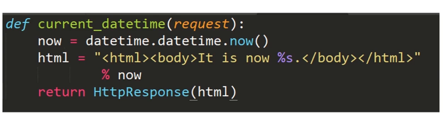

# Django

## Django命令

> check
> compilemessages
> createcachetable
> dbshell
> diffsettings
> dumpdata
> flush
> inspectdb
> loaddata
> makemessages
> makemigrations
> migrate
> runserver
> sendtestemail
> shell
> showmigrations
> sqlflush
> sqlmigrate
> sqlsequencereset
> squashmigrations
> startapp
> startproject
> test
> testserver

## 初识Django 项目

新建Django 项目

```python
django-admin startproject projectName
```

> 项目配置文件: settings.py
> 项目路由配置文件: urls.py
> 项目管理文件: manage.py

运行Django项目

```python
python manage.py runserver
```

## Django 项目 -- Django 应用

新建Django 应用

```python
# 需在Django项目的目录下去新建
django-admin startapp appName
```

- 区分

> 一个Django项目就是一个基于Django的Web应用
> 一个Django应用就是一个可以重用的Python软件包
> 每个应用可以自己管理模型、视图、模板、路由和静态文件等
> 一个Django项目包括一组配置和若干个Django应用

- Django应用

> views.py: 试图处理
> models.py: 定义语言模型
> admin.py: 定义Admin模块管理对象
> apps.py: 声明应用
> tests.py: 编写应用测试用例
> urls.py: (自建)管理应用路由

当新建一个Django应用后，因在项目的settings.py文件中加入相关配置信息

```python
INSTALLED_APPS = [
    ...
    # 自建应用添加 
    'blog.apps.BlogConfig'
]
```

## Django 视图

view.py实现简单helloworld

```python
from django.shortcuts import render

from django.http import HttpResponse

# Create your views here.

def hello_world(request):
    return HttpResponse("hello wolrd")
```

## Django 路由

配置路由绑定视图函数和URL
配置路由分为两个层次：应用 | 项目

- 应用层面

先新建urls.py路由配置文件,并添加视图文件信息

```python
from django.urls import path, include

import blog.views

urlpatterns = [
    path("hello_world", blog.views.hello_world)
]
```

- 项目层面

在项目的urls.py的路由配置文件中加入应用的路由配置信息

```python
from django.contrib import admin
from django.urls import path, include

urlpatterns = [
    ...
    path('blog/', include('blog.urls'))
]
```

## Djang 模型层

> 模型层位于Django视图和数据库之间
> Python对象和数据库表之间转换

- 可以屏蔽不同数据库之间的差异
- 开发者更加专注于业务逻辑的开发
- 提供更多便捷工具有助于开发

例子 博客文章模型

- 1.设计博客模型

```sql
文章标题    ---    文本类型[TextFiled]
文章摘要    ---    文本类型
文章内容    ---    文本类型
唯一ID标记  ---    Int数字类型[IntegerFiled](自增[AutoField]、主键[primary_key])
发布日期    ---    日期类型[DatetimeFiled]
```

- 2.模型层定义字段

在models.py中进行定义

```python
class Atricle(models.Model):
    # 唯一ID标记
    article_id = models.AutoField(primary_key=True)
    # 文章标题  
    title = models.TextField()
    # 文章摘要  
    brief_content = models.TextField()
    # 文章内容  
    content = models.TextField()
    # 发布日期  
    date = models.DateTimeField(auto_now=True)
```

- 3.模型迁移

```python
# 会在migrations内生成xxx.py文件代表模型
python manage.py makemigrations

# 将模型映射到数据库中
python manage.py migrate
```

- 4.模型注册到admin中

```python
# admin.py中
from .models import article
admin.site.register(article)
```

## Django Shell

Python Shell用于交互式的Python编程
Django Shell也类似，继承Django项目环境

- 临时性操作使用Django Shell更加方便
- 小范围的Debug更简单，不需要运行整个项目来测试

例子 新建文章

```python
# 进入Django环境
python manage.py shell
```

```Django
// 在Django环境中
from blog.models import Article
a = Article() 
a.title = "Test Django Shell"
a.brief_content = "Test Django Shell,By sb....."
a.content = "Test Django Shell,New Article,Main content."
// 保存
a.save()
// 获取数据
articles = Article.objects.all()
```

## Django Admin 模块

Django的后台管理工具
可读取定义的模型元数据，提供强大的管理使用页面

- Django Shell新增文章太复杂
- 管理页面是基础设施中重要的部分
- 认证用户、显示管理模型、校验输入等功能类型

使用

- 1.创建管理员用户

```python
python manage.py createsuperuser

# 填写用户名密码
Username:
Email address:
Password:
Password (again):

# 表示创建成功
Superuser created successfully.
```

- 2.登录页面进行管理

xxx/admin
可进行一些简易操作

查看文章时返回文章标题

```python
# models.py 的Article类中定义函数
def  __str__(self):
    return self.title
```

- 图(1)


- 图(2)


## 实现博客数据返回页面

- 1.编写返回函数

```python
# views.py中
def article_content(request):
    article = Article.objects.all()[0]
    title = article.title
    brief_content = article.brief_content
    content = article.content
    article_id = article.article_id
    date = article.date
    return_str = "title: %s,brief_content: %s,' \
                'content: %s,article_id: %s,date: %s" % (title, 
                                                        brief_content, 
                                                        content, 
                                                        article_id, 
                                                        date)

    return HttpResponse(return_str)
```

- 2.配置应用路由

```python
# 应用的urls.py中
urlpatterns = [
    ...
    path("content",blog.views.article_content)
]
```

- 3.配置项目路由

```python
# 项目的urls.py
urlpatterns = [
    ...
    path("blog/", include('blog.urls'))
    # 因为项目直接指向应用的urls
    # 所以一个应用只需配置一次，那么应用的所以路由均可使用了
]
```

## 使用Bootstrap 实现静态博客页面

### 页面布局设计

在blog目录下新建templates，在其中创建页面

- [博客页面](./django_introdution/blog/templates/static/index.html)

)

- [文章页面](./django_introdution/blog/templates/static/detail.html)


### [Bootstrap](https://www.bootcss.com) 以及Bootstrap 的栅格系统

- 来自美国Twitter的前端框架
- 提供非常多的控件并附带源码
- 栅格系统把页面均等分为十二等份

### 实现静态页面

在blog下新建templates文件夹，新建index.html和detail.html

## Django的模版系统

### 简介

试图文件不适合编码HTML，如下这样页面设计改变需要改变Python代码
网页逻辑和网页视图应该分开设计



- 模板系统的表现形式是文本
- 分离文档的表现形式和表现内容
- 模板系统定义了特有的标签占位符

### 基本语法

- 变量标签: {{变量}}


- for循环标签: ,


- if-else分支标签: ,,


### 使用模板系统渲染博客页面

以[首页](./django_introdution/blog/templates/blog/index.html)为例

- 用模板语法渲染html文件
- 编写视图函数
- 配置路由
